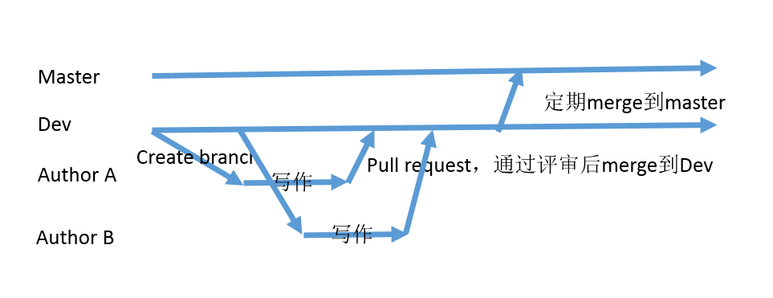

# 创建合适的分支以方便多人合作

分支是github中的非常重要的概念。如果从代码开发的角度看，需要考虑的会比较复杂。但是我们这里主要是从合作写书的角度来看分支的创建，相对来说要简单一些。

建议创建三类分支：

1. master分支：这个是默认的分支，这个分支作为正式发布出去的分支。所有要发布的内容，最终都要merge到这个分支上，这个分支是呈现给最终的读者看的。

2. dev分支：除了默认的分支外，通常需要创建一个dev分支，这个是开发中的分支，在内容正式发布前，所有作者把自己的内容merge到这个dev分支上。merge到dev分支上的内容必须是通过评审的。dev上的内容可以根据情况，定期merge到master分支上，并打上版本标识。例如：每个月底发布一次，那么每个月底做一次从dev到master的merge。

3. 然后每个人写的时候要从dev创建一个自己的分支：可以用自己名字命名，或者用作者要写的内容命名。这是一类分支，可能会有多个，通常每个参与者都会创建自己的分支。平时作者写作的话都是在这个分支上完成，当一部分内容完成后，就发起一个pull request，邀请相关人评审，并merge到dev分支上。

   下面是一个简单的示意图：

   