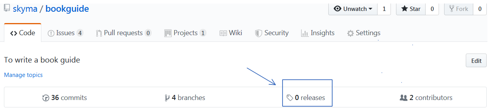

# 如何定期发布编写完成的内容

回想一下我们之前聊过的关于合作写书的分支的设定。所谓的发布，主要是将dev分支上内容merge到master分支上。

具体的操作其实和作者将自己分支上的内容merge到dev分支上是一样的。可以根据需要选择定期发布编写的内容，可以是每个月、每周，甚至每天，都可以。

为了更好的管理发布的内容，可以定期根据需要打上版本标签。例如：v1.0、V2.0。如果想打上版本标签的话，可以点击下图的releases，在出现的页面中创建自己的版本。

