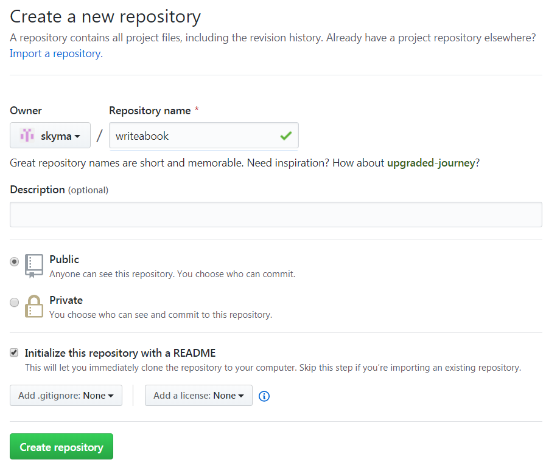
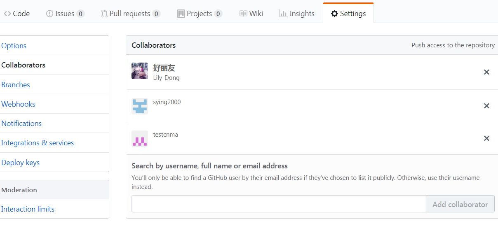

# 创建repository，并添加contributor

## 点击首页上的“Start  a new project”创建一个repository。

`

还可以在页面的左边或者页面的右上角创建。

`

`

## 在新建repository的界面中输入相关信息。

## 为新建的repository添加collaborators

由于是合作写书，所以需要把一起合作的同学都加成collaborators，这样大家就都可以直接修改文章内容。

