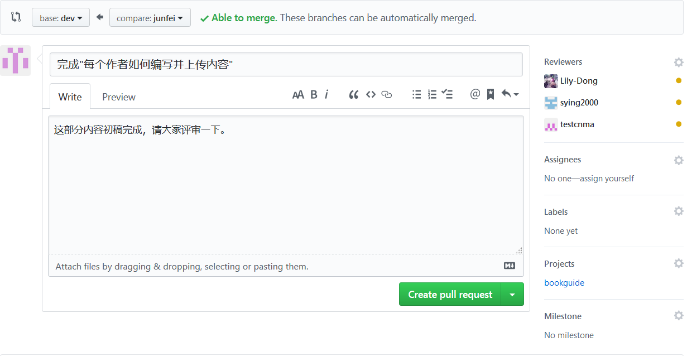
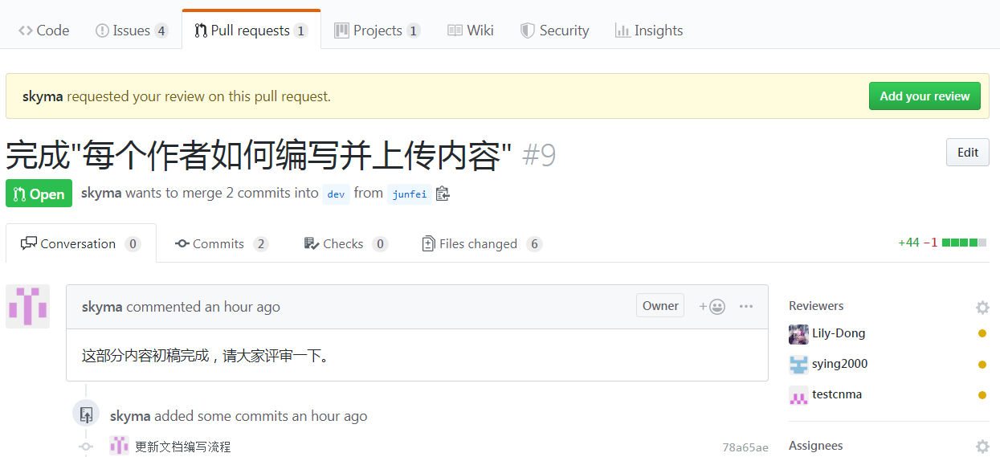
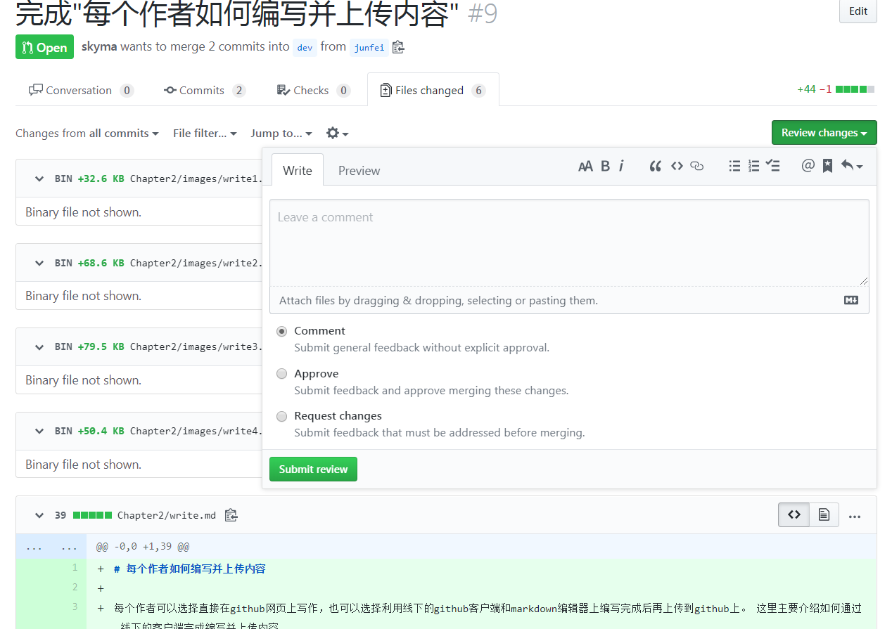
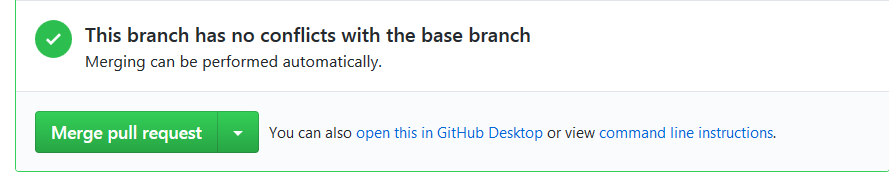

# 如何进行评审

作者写完一部分内容后，在将内容merge到dev分支上之前，需要进行评审。github上的评审是利用pull request来实现的。发起一个pull request的时候，可以指定reviewer进行评审。

## 发起pull request，指定reviewers

## 作者发起pull request的时候

发起pull request可以将作者当前分支的内容merge到dev分支上。在merge之前，可以让指定的reviewers来对将要修改的内容进行评审。

pull request可以直接在github的网页上发起，可以从github desktop客户端发起（但其实也是直接打开网页来操作的）。下面的图是创建pull request。可以填写合适的标题和具体的描述。在右边一栏有一些字段可以指定，这里可以选择reviewers。右边一栏还可以指定Projects，这里指定了projects后，对于后面管理整个项目的看板是有帮助的。具体内容可以参见后面的github中的项目管理方面的章节。

## 评审人员进行评审

1. 上面在创建了pull request并指定评审人员后，相关评审人员的界面就会收到评审活动的通知。如下图所示。

2. 点击上图中的request，就可以打开要求评审人员评审的pull request。如下图所示。

   

3. 点击上图中的“add your review”，就可以进行评审，并提交评审意见了。出现的界面如下。

   这个界面是评审人员需要只用的主要的界面。作为评审人员，你可以在这个页面的下面看到所有的变更到底是什么。然后你可以根据具体情况，填写你的comment，然后选择Comment、approve或者request changes。

   

## 作者根据评审意见进行修改

看到评审人员的意见后，作者根据需要对原文进行修改。作者这里的修改可以继续在原来自己的分支上修改，修改完成后push到github上。此时，原来的pull request中会自动同步最新的修改的记录。

## 作者将评审后的内容merge到dev分支

重新打开原来提交的pull request，点击页面中有merge pull request，并在接下来的页面中confirm merge就完成了将自己编写的内容merge到dev分支的操作了。

