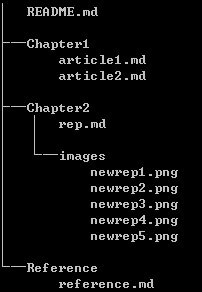

# 设置github上的目录结构为写书做准备 

有很多人利用github来写书，大体上有两种目录结构。一种是直接都写在README.md中，始终维护README.md这个文件，如果有图片的话，可以在根目录下面创建一个images文件夹来存在图片，在README.md中使用相对路径来插入图片；如果图片是使用外部的图床，书中可以直接用外面的图片的连接，那么连images这样的文件夹都不需要。

如果考虑到有多个人合作写书的情况，推荐用下面的方式来创建github上的目录：

1. README.md：主要是书的封面和目录，每个目录链接到下面编写的各个文档

2. 根据书的内容进行分类，每一类创建一个文件夹。例如：可以按照章节，每一章创建一个文件夹，后面每章编写的内容在相应的目录下面

3. 每个文件夹中创建一个images目录，用于存放图片，这样可以利用相对位置直接在各自的md文件中插入图片。

4. 每个小节的内容单独存放一个md文件，放在对应的章节文件夹下面。如果每章有多个小节的话，可以创建多个md文件。

   这个主要取决于整个写作团队的分工。如果每个人负责一章，那么每章只要一个md文件就可以了，这种情况下，连每章的文件夹都可以不用建立。如果每章有多个小节，而且每个小节都是不同的人编写的，那么每个小节都创建一个md文件要更方便管理一些。

   下图是一个简单的目录结构。

