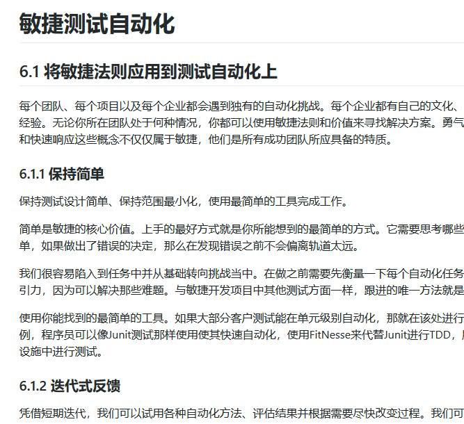
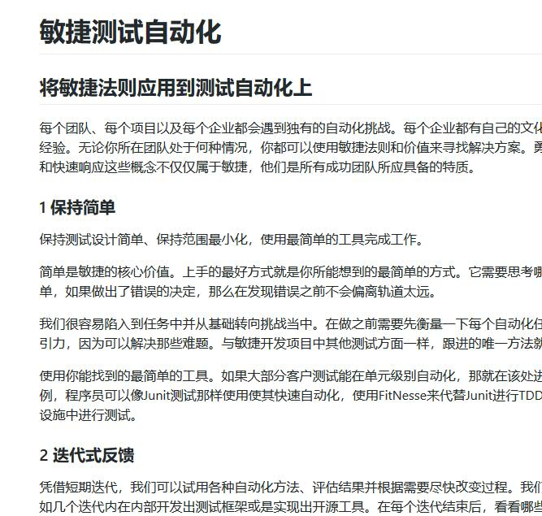

# “拥抱变化”--对书的章节目录合理编号

我们都知道一本书通常都有很多章节，我们会按照顺序给它们一个编号。第1章，第2章，第3章等。每个章下面还有很多小结，例如1.1, 1.2, 2.1 等。这种编号在通常的写书过程中是非常需要的，但是在我们合作写书，以及希望每个月甚至每周发布的时候就出现了一些问题。那就是我们没有办法在刚开始的时候就把整个书的目录完全固定好，无论是二级目录还是一级目录都可能在编写的过程中发生变动。可能是顺序需要调整，也可能是整个章节不需要了，或者增加一个章节。都会导致后期很多章节需要重新编号，这种无谓的返工并没有什么特别的意义。

为了克服这种情况，保证我们能够以敏捷的方式持续不断的交付，能够“拥抱变化”，有个好的实践就是不要对出现在整个书的封面目录中出现的章节编号，通常是一级目录和二级目录。虽然没有了编号，看起来可能会有点“不顺眼”，但是利用markdown中的本身的目录结构还是可以弥补这个缺点的。

这个问题出现在我们开始编写敏捷测试这本书的时候。下图是当时的封面的目录结构。我们当时规划了7章，每章下面有一些二级目录。这本书的编写本身也是采用敏捷的方式，不是一次交付，而是一个月交付一次，持续交付的。

可以看第六章敏捷自动化下面的第一个小节“将敏捷法则应用到测试自动化上”。点进去的编号见下图。

按照原计划这个是第六章，所以上图中的编号本身完全没有问题。但是这个是建立在前面所有大的章节没有增加和删除的前提下的，万一后面有修改，都会导致这里的编号出现问题，需要返工。所以这里将出现在总的目录中的章节的编号取消，每个小的章节里面的内容单独编号，这样就避免了重新编号带来的问题。修改后的结构如下。

