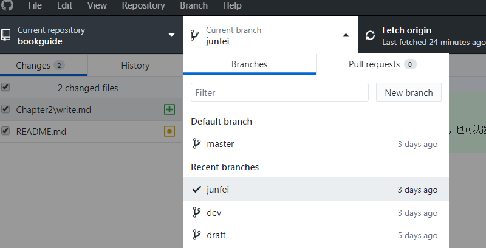
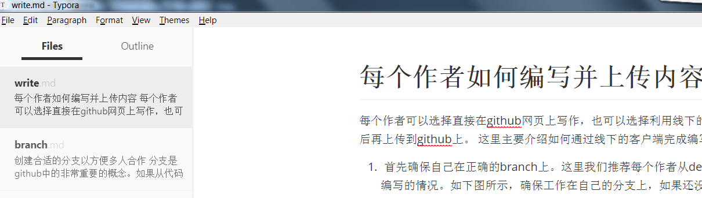

# 每个作者如何编写并上传内容

每个作者可以选择直接在github网页上写作，也可以选择利用线下的github客户端和markdown编辑器上编写完成后再上传到github上。 这里主要介绍如何通过线下的客户端完成编写并上传内容

## 首先确保自己在正确的branch上。

这里我们推荐每个作者从dev分支上拉一个自己的分支，以适应多人合作编写的情况。如下图所示，确保工作在自己的分支上，如果还没有的话，请创建一个自己的branch。

创建分支的时候务必从dev分支上创建自己的分支，很多时候缺省是master分支，那么就会导致你不是在最新的分支上编写内容，将来merge的时候，可能会出现不必要的冲突。

## 创建markdown文件

如果是对已有文章的修改，那么直接打开已经存在的文章就可以了。如果是新的章节，那么就需要新创建一个markdown文件。通常推荐每一节创建一个新的文件。

## 打开对应的markdown文件，就可以开始干活了

这里我用的是Typora的编辑器。这个编辑器没有自动保存功能，记得及时存盘哦。

## 将文章commit到自己的分支上

这里要从markdown的编辑器回到github desktop上。

