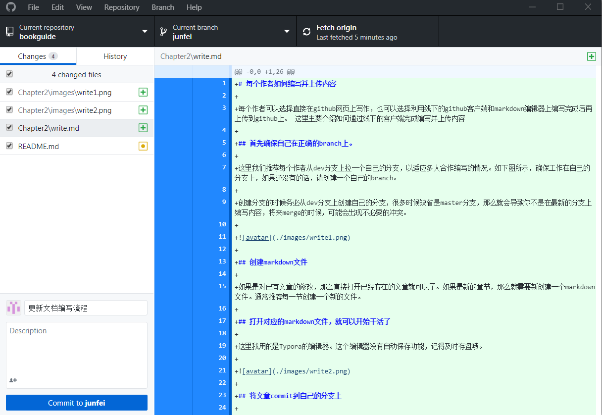
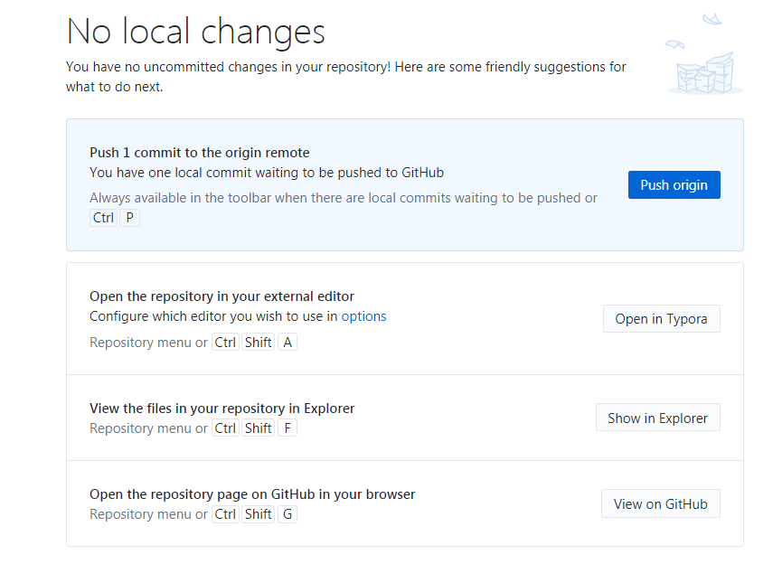

# 每个作者如何编写并上传内容

[TOC]

## 首先确保自己在正确的branch上。

这里我们推荐每个作者从dev分支上拉一个自己的分支，以适应多人合作编写的情况。如下图所示，确保工作在自己的分支上，如果还没有的话，请创建一个自己的branch。

创建分支的时候务必从dev分支上创建自己的分支，很多时候缺省是master分支，那么就会导致你不是在最新的分支上编写内容，将来merge的时候，可能会出现不必要的冲突。

## 创建markdown文件

如果是对已有文章的修改，那么直接打开已经存在的文章就可以了。如果是新的章节，那么就需要新创建一个markdown文件。通常推荐每一节创建一个新的文件。

## 打开对应的markdown文件，就可以开始干活了

这里我用的是Typora的编辑器。这个编辑器没有自动保存功能，记得及时存盘哦。

## 将文章commit到自己的分支上

这里要从markdown的编辑器回到github desktop上。github desktop能够自动检测到修改的地方。点击左下角的commit就可以把修改的内容commit到自己的分支上。这里通过左边的变更列表可以看到，这次修改是增加了三个文件，修改了一个文件。点击左下角的commit就可以把修改的内容commit到自己的分支上。

## 上传本地内容到github服务器上

上一步中的commit是将修改的内容放到了本地的作者自己的分支上了，但是保存的内容还是在本地的。这个时候其他人其实是看不到你修改的内容的，我们需要及时将本地的内容同步到github的服务器上。虽然没有强制要求多久一定需要同步本地内容到服务器上，但是通常，每天结束的时候最好都能同步一次。这样一方面其他人能够了解你写的内容，另外也确保不会因为自己电脑有什么问题而导致编写的内容的丢失。

在上一步commit后，就会出现让你做push origin的按钮。这个就是让你同步本地内容到github上的。当然，你可以通过菜单中的Repository->push来完成。

到此为止，作者就成功的上传了自己编写的内容。下一步就可以开始评审啦！