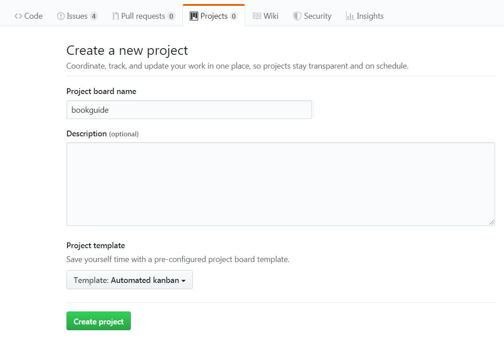
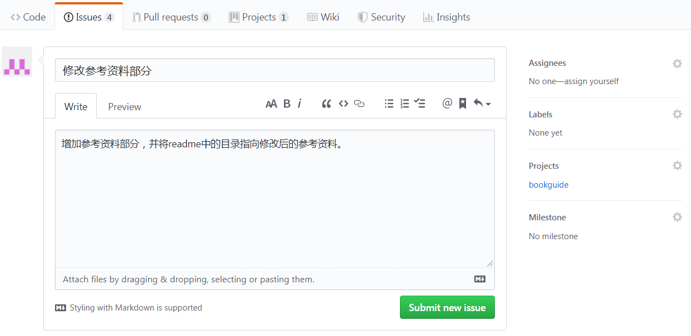
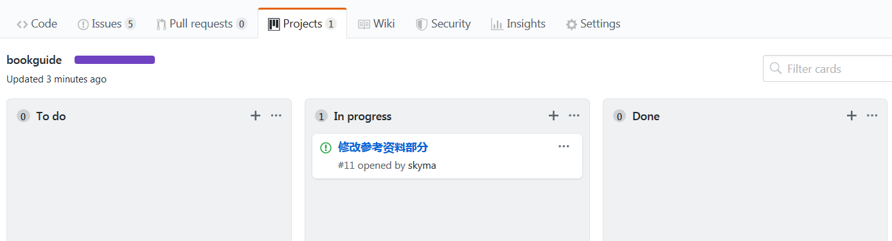
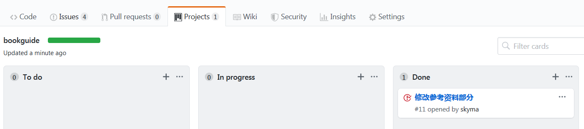

# 如何使用project功能管理日常的写作任务

## 创建一个project用于管理写作任务

在repository中创建一个project，这样就可以利用kanban来管理写作任务了。每个repository中可以创建多个项目。

创建项目的页面如下。创建的时候可以选择项目模板，这里我们选了一个automated kanban，可以自动的管理issue和pull request。这个后面有需要也可以根据情况再修改。

## 利用issue来管理写作任务

分解后的每个任务可以创建一个issue。创建issue的页面如下。

这里要注意右边的内容的填写。可以在这里通过assignees来指定这个issue的负责人；右边的projects必须选择上面创建好的project（这里是bookguide），只有指定了project，这个issue才能在相应的项目kanban中显现出来。

在创建了这个issue后，我们再次回到project的kanban界面，就会发现这个issue出现在了to do这一列里面。我们可以利用这种方法把各个写作任务都创建成issue。当有人认领以后，就把这个issue挪到in progress这一列里面就可以了。

## 任务完成，关闭issue

当我们完成了相应的写作任务后，可以将对应的issue关闭。此时project中的kanban会自动根据issue状态的变化，将该issue从in progress状态换到Done状态。

